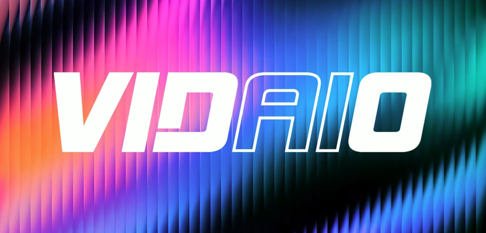

# **vidAio Subnet**: Revolutionizing Video Upscaling with AI-Driven Decentralization <!-- omit in toc -->

Please check our [Tweet](https://x.com/vidaio_τ) to follow us.

 

---

## **Table of Contents**

1. [Introduction](#1-introduction)
2. [Subnet Architecture](#2-subnet-architecture)
   - [Overview](#21-overview)
   - [Miners](#22-miners)
   - [Validators](#23-validators)
   - [Synapses](#24-synapses)
     - [Synthetic Query](#241-synthetic-query)
     - [Organic Query](#242-organic-query)
3. [Setup](#3-setup)
4. [Roadmap](#4-roadmap)
5. [Appendix](#5-appendix)
   - [Technical Glossary](#a-technical-glossary)
   - [References](#b-references)
   - [Contact Information](#c-contact-information)

## **1. Introduction**
vidAIo's mission is to democratize video enhancement through decentralization, artificial intelligence, and blockchain technology. Leveraging the Bittensor ecosystem, vidAIo provides creators, businesses, and developers with scalable, affordable, and high-quality video upscaling solutions while ensuring full ownership and control over their content

## 2. Subnet Architecture

### 2.1 Overview
- **Miners**: Handle video upscaling tasks and optimize models to ensure high-quality outputs.
- **Validators**: Assess miner performance using predefined metrics to maintain network integrity.

### 2.2 Miners
Miners enhance video quality using AI-driven upscaling techniques. They can:
- Optimize open-source models or develop proprietary ones for superior results.
- Handle video upscaling requests from validators and end-users.

### 2.3 Validators
Validators ensure miners deliver consistent, high-quality results by evaluating performance through synthetic and organic queries.

### 2.4 Synapses
#### 2.4.1 Synthetic Query
Validators benchmark miner performance using controlled datasets:
- Downscale a high-resolution video to low-resolution.
- Miners upscale the low-resolution video back to high.

- Validators assess the upscaled output using metrics VMAF, LPIPS and latency.

#### 2.4.2 Organic Query
Real-world video data uploaded by users is processed as follows:
- Videos are chunked and queued for miners.
- Miners process and upscale the chunks.
- Results are aggregated and delivered back to users.

### 2.5 Incentive mechanism
- [Incetive Mechanism Guide](docs/incentive_mechanism.md)

## 3. Setup
- [Validator Setup Guide](docs/validator_setup.md)
- [Miner Setup Guide](docs/miner_setup.md)

## 4. Roadmap

### Phase 1: Implementing the Upscaling Synapse
- Launch the subnet with AI-powered video upscaling.
- Focus on real-time processing of low-quality videos into high-definition formats.

### Phase 2: Developing an AI-Powered Video Compression Model
- Build AI models for adaptive bitrate streaming.
- Optimize bandwidth usage while maintaining video quality.

### Phase 3: Implementing the Transcode Optimization Synapse
- Introduce AI-driven transcoding for compatibility across devices.
- Evaluate miners on speed, quality, and efficiency.

### Phase 4: On-Demand Streaming Architecture
- Enable decentralized on-demand video streaming with integrated storage.
- Utilize peer-to-peer (P2P) models for redundancy and high availability.

### Phase 5: Live Streaming Through the Subnet
- Introduce live streaming with real-time AI-powered upscaling and transcoding.
- Integrate adaptive bitrate streaming for smooth playback.

### Phase 6: Subnet API for Real-World Integration
- Develop a RESTful API for seamless integration with external platforms.
- Include features for uploading, processing, and retrieving videos.

## 5. Appendix

### A. Technical Glossary
- **VMAF**: [Video Multimethod Assessment Fusion](https://github.com/Netflix/vmaf)
- **LPIPS**: [Learned Perceptual Image Patch Similarity](https://github.com/richzhang/PerceptualSimilarity)
- **TOPIQ**: [Top-down Image Quality Assessment](https://arxiv.org/pdf/2308.03060v1)
- **Bittensor Subnet**: [Decentralized AI Framework](https://docs.bittensor.com)
